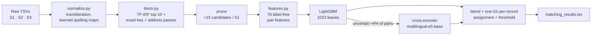

<div align="center">

# Business Entity Resolution at Scale

**Amazon ML Challenge 2026 — Team wsg**

Matching 1.7M reference businesses against 10M noisy records from two other sources,
across the US, India and an unseen country (France).

[](#results)
[](#leaderboard-progression)
[](pyproject.toml)
[](https://github.com/microsoft/LightGBM)
[](https://pytorch.org)
[](https://huggingface.co/intfloat/multilingual-e5-base)
[](https://modal.com)
[](LICENSE)

**Siddartha A Yogesha** · **Kshirin Shetty**

</div>

---

## Contents

- [The problem](#the-problem)
- [Results](#results)
- [Solution overview](#solution-overview)
- [Approach in detail](#approach-in-detail)
- [Leaderboard progression](#leaderboard-progression)
- [What worked and what did not](#what-worked-and-what-did-not)
- [Reproducing the submission](#reproducing-the-submission)
- [Repository layout](#repository-layout)
- [Rules, licenses and compliance](#rules-licenses-and-compliance)
- [Team](#team)

## The problem

Three independent sources describe the same businesses with no shared identifier. **Source 1** is a clean,
deduplicated reference; **Sources 2 and 3** hold noisy variants (typos, abbreviations, reordered or missing address
parts, transliterated Indic scripts, trade names) plus **decoys**: near-copies of a real business that must *not*
be matched. For every Source 1 entity, the task is to return all matching Source 2/3 records.

- **Metric:** macro F0.5 per Source 1 entity (precision counts twice as much as recall; an entity with no true
  match scores 1 only if we predict nothing).
- **Scale:** train 2.21M S1 / 10.3M S2+S3 records (7.64M true pairs); test 1.73M S1 / ~10M S2+S3.
- **Twist:** the test set adds **France**, a country absent from training, and has more decoys (≈ 42% of S2/S3
  records vs 26% in train).
- **Constraints:** no external data, APIs or geocoding; the final model must be MIT/Apache-licensed and ≤ 8B
  parameters; smaller candidate sets rank higher in the final review.

Full statement: [`docs/problem_statement.md`](docs/problem_statement.md).

## Results

| | |
|---|---|
| **Final submission** (package from run [023](runs/023_cross-encoder-base/)) | **F0.5 ≈ 0.985** |
| Best public-leaderboard upload (run [022](runs/022_cross-encoder/)) | **0.981** |
| Final standing | **#1066** |
| Validation F0.5 / at test decoy density ("dense") | 0.987 / 0.981 |
| Blocking recall (true pairs kept among candidates) | 97.9% |
| Candidates per Source 1 entity (test) | 15.3 (of ~10M possible records) |
| Model | LightGBM (78 features) + fine-tuned `multilingual-e5-base` cross-encoder (278M params) |
| Total compute | ≈ $38 of Modal credit (32-CPU containers, one H100 for the cross-encoder) |

## Solution overview



Two observations shaped everything:

1. **Every S2/S3 record matches at most one S1.** Candidate generation therefore runs *from* each S2/S3 record into a
   per-country S1 index, and the final decision assigns each record to its single best S1 (or to none).
2. **Decoys are near-copies with a marker** (an extra word such as `Holdings` / `Overseas`, a different legal form,
   a shifted house number). Most features describe exactly those differences, computed **without labels** so they
   transfer unchanged to France.

## Approach in detail

<details open>
<summary><b>1. Normalization</b> — <code>src/normalize.py</code></summary>

- Alias stripping (`X formerly/fka/aka/dba Y → Y`), Unicode transliteration (`unidecode`), removal of domains,
  phone numbers and punctuation, collapsed repeated letters, legal-form stop list.
- **Spelling maps learned from matched training pairs** (≈1.5k name and ≈4.7k address token maps, e.g.
  `praivet → private`, `sacrmento → sacramento`).
- **Filler words detected per split and country without labels** (tokens over-represented in S2/S3), removed for
  blocking only; a "full" name keeps them for the decoy features.
- Address abbreviations, US/Indian state names → codes, French `n°`.
</details>

<details open>
<summary><b>2. Candidate generation (blocking)</b> — <code>src/block.py</code></summary>

Per country, every S2/S3 record looks up its closest S1 entities:

| Pass | What it recovers |
|---|---|
| **TF-IDF top-10**: `0.6·cos(name char 4-grams) + 0.4·cos(address word 1–2-grams)`, exact sparse top-k (`sparse_dot_topn`) | the bulk of the matches |
| **Exact keys**: sorted name words, consonant skeleton, spacing-free name, first two words, house number + street | names made only of common words, which TF-IDF down-weights |
| **Address pass**: best 1–2 S1s by address alone | records whose name loses to look-alike S1 names ("Ram Private Limited Center" at its S1's exact address; made-up trade names; Indic-script names). India recall 95.2% → 97.0% |
| **Pruning**: keep a record's best candidate, key/address pairs, and runner-ups within 80% of its best score; cap 30 per S1 | keeps ≈15 candidates per S1 |

Recall on training labels: 85.1% (v0) → 95.3% → 96.7% (keys) → 97.1% → **97.9%** (address pass).
</details>

<details open>
<summary><b>3. Pair features</b> — <code>src/features.py</code> (78, all label-free)</summary>

- **Name / address similarity:** rapidfuzz ratio, token-set/-sort, partial ratio, Jaro-Winkler, TF-IDF cosines.
- **Decoy signals:** words one side has and the other lacks (on the full name) and a *label-free* decoy score per
  word (how often records carrying it disagree with their best S1's house number); house-number overlap, first
  number equality and distance; whether the S1's number appears in the record.
- **Context:** retrieval rank/score, gap to the record's best and second-best candidate, records pointing at the
  S1, **sibling agreement** (other records of the same S1 sharing this record's house number).
- **Ambiguity:** how many S1s share the name/address; share of the record's words known in the country's S1
  vocabulary (detects made-up trade names).
- **Within-record tie-breaks:** raw-text similarity of each candidate compared with the record's other candidates.
- **Formatting noise** of the raw record: domain-only names, letter case, accents, digits inside words,
  punctuation, `#` / door-number markers. True records carry more source noise than decoys (domain-only names
  are 4% decoys vs 26% overall).
</details>

<details open>
<summary><b>4. LightGBM matcher</b> — <code>src/match.py</code></summary>

Binary LightGBM (`num_leaves 1023, min_data_in_leaf 100, learning_rate 0.05, feature/bagging fraction 0.8`,
early stopping) on the candidate pairs of 80% of training S1s; the other 20% are the validation set. Each S2/S3
record is assigned to its highest-probability S1 and kept if the probability clears a threshold picked on
validation.
</details>

<details open>
<summary><b>5. Cross-encoder second stage</b> — <code>tools/ce_prep.py</code>, <code>tools/ce_gpu.py</code>, <code>tools/ce_blend.py</code></summary>

LightGBM plateaued at 0.977 dense validation regardless of tuning, because its features reduce the text to a few
similarity scores. The final stage lets a transformer read both records:

- **Hard pairs only:** records whose best LightGBM probability is in [0.02, 0.995] or whose second-best exceeds
  0.02, i.e. ≈ 4% of candidate pairs (1.1M train, 1.4M test).
- **Model:** [`intfloat/multilingual-e5-base`](https://huggingface.co/intfloat/multilingual-e5-base) (MIT,
  278M params, multilingual incl. Indic scripts) with a linear head, input `"name | address"` of the record vs
  the S1, raw text (case, accents and scripts kept). One epoch on 0.74M pairs from records that never touch the
  validation fold; bf16, batch 256, lr 4e-5; **5 minutes on one H100**.
- **Blend:** `p = 0.5·p_LightGBM + 0.5·p_cross-encoder` on the hard pairs; weight and threshold (0.6) picked on
  dense validation. On its own the cross-encoder is *weaker* than LightGBM on these pairs (accuracy 0.76 vs
  0.88), but its mistakes are different, and the blend added **+0.004 dense F0.5, the largest single gain of the
  project** (leaderboard 0.974 → 0.981).
</details>

<details open>
<summary><b>6. Validation that tracks the leaderboard</b></summary>

The test set is decoy-denser than train (≈ 42% vs 26% of S2/S3 records, estimated without labels from records
per S1). **Dense validation** removes half of the true records from the validation fold to reproduce that
density. From run 006 on it tracked the leaderboard within ≈ 0.003 (e.g. 0.9806 → 0.981), while plain validation
was 0.006–0.01 optimistic. The one exception was stage-2 stacking (run 007), whose gain came from exactly the
decoy context dense validation does not add. All later decisions were made on dense validation.
</details>

## Leaderboard progression

| Run | Change | Blocking recall | Dense val | Public LB |
|---|---|---|---|---|
| [001](runs/001_tfidf-lgbm-baseline/) | TF-IDF reverse blocking + LightGBM (29 features) | 0.953 | — | 0.933 |
| [002](runs/002_learned-cleaning/) | learned spelling maps, filler removal, pruning | 0.952 | — | 0.945 |
| [003](runs/003_decoy-features/) | label-free decoy features | 0.952 | — | 0.957 |
| [006](runs/006_ambiguity-bigger-model/) | ambiguity features, larger LightGBM, top-10 retrieval | 0.958 | 0.964 | 0.961 |
| [013](runs/013_keys-safecap-nosynth/) | exact-key blocking passes, safe per-S1 cap | 0.971 | 0.970 | 0.967 |
| [014](runs/014_relative-tiebreak/) | within-record tie-break features | 0.971 | 0.972 | 0.970 |
| [016](runs/016_address-pass/) | address-only retrieval pass, 1023-leaf LightGBM | 0.978 | 0.976 | 0.974 |
| [018](runs/018_noise-markers/) | formatting-noise features | 0.978 | 0.977 | 0.974 |
| [022](runs/022_cross-encoder/) | cross-encoder (e5-small) blended on hard pairs | 0.979 | 0.981 | **0.981** |
| **[023](runs/023_cross-encoder-base/)** | **cross-encoder e5-base — final package** | **0.979** | **0.981** | **≈ 0.985 final** |

<details>
<summary>All 25 experiments (including the ones that did not work)</summary>

| Run | What changed | Blocking recall | Candidates / S1 (test) | Val F0.5 | Leaderboard |
|---|---|---|---|---|---|
| [000](runs/000_blocking-char3-v0/) | blocking v0: char-3gram name + address-word TF-IDF, `max_df=0.002` | 0.851 (train) | — | — | — |
| [001](runs/001_tfidf-lgbm-baseline/) | baseline: char-4gram name + address uni/bigram TF-IDF blocking, LightGBM on 29 features | 0.953 | 17.3 | 0.949 | 0.933 |
| [002](runs/002_learned-cleaning/) | learned spelling maps + alias/filler removal, prune (rel 0.7, cap 30), +4 features, expected-F0.5 per-S1 decisions | 0.952 | 7.8 | 0.957 | 0.945 |
| [003](runs/003_decoy-features/) | label-free decoy features: extra words + decoy-word score, S1 house number in record, sibling agreement | 0.952 | 7.8 | 0.971 | 0.957 |
| [004](runs/004_france-selftrain/) | 003 + self-training on confident France test pairs | 0.952 | 7.8 | 0.970 | not submitted (no change) |
| [005](runs/005_deeper-retrieval/) | 003 + top-10 retrieval, prune REL 0.8 / cap 30 | 0.958 | 9.4 | 0.971 | not submitted |
| [006](runs/006_ambiguity-bigger-model/) | 005 + name/address ambiguity + made-up-name features, larger LightGBM | 0.958 | 9.4 | 0.975 | 0.961 |
| [007](runs/007_stage2-stacking/) | 006 + stage-2 stacking on out-of-fold probabilities; dense validation introduced | 0.958 | 9.4 | 0.977 (dense 0.967) | 0.960 |
| [probes](runs/probes/) | 006 model at stricter thresholds 0.80 / 0.90 | — | — | — | 0.959 / 0.956 |
| [008](runs/008_synthetic-decoys/) | 006 + 2.6M synthetic decoys (train at test decoy density) | 0.957 | 9.4 | 0.973* | not submitted |
| [009](runs/009_multipass-blocking/) | 006 + exact-key blocking passes | 0.967 | 11.9 | 0.978 (dense 0.968) | — |
| [010](runs/010_multipass-synth/) | 009 blocking + synthetic decoys | 0.966 | 11.9 | 0.976* (dense 0.965) | — |
| [011](runs/011_more-keys-synth/) | 010 + skeleton / spacing-free / first-two-words keys | 0.968 | 13.3 | 0.973* | not submitted |
| [blend](runs/blend_009_010/) | 0.3·009 + 0.7·010 probabilities | — | 11.9 | 0.976* (dense 0.966) | 0.961 |
| [012](runs/012_keys-synth-safecap/) | 011 + cap never drops a record's best candidate | 0.970 | 13.5 | 0.977* (dense 0.967) | 0.961 |
| [013](runs/013_keys-safecap-nosynth/) | 012 without synthetic decoys | 0.971 | 13.5 | 0.979 (dense 0.970) | 0.967 |
| [014](runs/014_relative-tiebreak/) | 013 + within-record tie-break features | 0.971 | 13.5 | 0.981 (dense 0.972) | 0.970 |
| [015](runs/015_lgbm-ensemble/) | 014 + 3-model LightGBM average | 0.971 | 13.5 | 0.981 (dense 0.9721) | not submitted |
| [016](runs/016_address-pass/) | 014 + address-only top-1 retrieval pass, 1023-leaf LightGBM | 0.978 | 14.5 | 0.984 (dense 0.976) | 0.974 |
| [017](runs/017_refit-all-folds/) | 016 refit on all training folds | 0.978 | 14.5 | — | 0.971 |
| [018](runs/018_noise-markers/) | 016 + 17 formatting-noise features | 0.978 | 14.5 | 0.984 (dense 0.9766) | 0.974 |
| [019](runs/019_scratch-addr2/) | 018 from scratch + second address match (≥ 90% of best) | 0.979 | 15.3 | 0.9845 (dense 0.9769) | — |
| [020](runs/020_lr003/) | 019 features, LightGBM lr 0.03 | 0.979 | 15.3 | 0.9846 (dense 0.9770) | — |
| [021](runs/021_leaves2047/) | 019 features, 2047 leaves | 0.979 | 15.3 | 0.9844 (dense 0.9768) | — |
| [022](runs/022_cross-encoder/) | 019 + multilingual-e5-small cross-encoder blended on hard pairs | 0.979 | 15.3 | 0.9870 (dense 0.9806) | 0.981 |
| [023](runs/023_cross-encoder-base/) | 022 with multilingual-e5-base — **final package** | 0.979 | 15.3 | 0.9871 (dense 0.9809) | ≈ 0.985 (final) |
| [024](runs/024_ce-wide/) | cross-encoder on a wider band of pairs (stopped: crashed scoring 3.1M test pairs) | 0.979 | 15.3 | — | — |

\* validated with synthetic decoys in context, which turned out not to transfer to the real test set.
Every `runs/<NNN_name>/` folder holds a README (why / what / results), the exact `src/` snapshot,
`metrics.json`, an error sample and the Modal log; most also hold the trained LightGBM model.
</details>

## What worked and what did not

| ✅ Worked | ❌ Did not |
|---|---|
| **Cross-encoder on uncertain pairs** blended with LightGBM (+0.4 pt dense, +0.7 pt leaderboard) | **Synthetic decoys** to match test density: better on validation, −0.6 pt on the leaderboard |
| **Dense validation** at the test's decoy density — the only proxy that tracked the leaderboard | **Stage-2 stacking** on out-of-fold probabilities: +0.4 validation, −0.1 leaderboard |
| **Multi-pass blocking** (exact keys, then the address pass): the largest LightGBM-era gains | **Refit on 100% of train** with scaled rounds: 0.974 → 0.971 |
| **Label-free decoy features** that describe how decoys are made, so they work on unseen France | France self-training, stricter thresholds, LightGBM ensembles and bigger trees: no change |
| Measuring *where* the loss is before optimizing (never retrieved vs rejected vs false merges) | Separate thresholds per segment; same-name sibling voting (55% accurate) |

## Reproducing the submission

The full recipe, with hardware, cost, expected numbers and troubleshooting, is in
**[`docs/REPRODUCING.md`](docs/REPRODUCING.md)**. The short version, on [Modal](https://modal.com) (≈ 1 hour, ≈ $5):

```bash
git clone https://github.com/kshirinshetty/amazon-ml-challenge-26.git && cd amazon-ml-challenge-26
uv sync && modal setup                                                # Python 3.12 env + Modal login

modal run modal_app.py --run final --no-synth                         # data → blocking → features → LightGBM
modal run modal_app.py --script "tools/ce_prep.py runs/final"         # uncertain pairs + raw text
modal run tools/ce_gpu.py                                             # cross-encoder on one H100
modal run modal_app.py --script "tools/ce_blend.py runs/final"        # blend → runs/final/output/
```

Full-data stages need ≈ 64 GB of RAM; a 16 GB laptop runs out of memory, which is why every stage runs on Modal.

## Repository layout

```
├── src/                     pipeline
│   ├── normalize.py         raw TSVs → cleaned parquet, learned spelling maps
│   ├── block.py             TF-IDF + exact-key + address retrieval, pruning
│   ├── features.py          78 label-free pair features
│   └── match.py             LightGBM fit / dense validation / predict / write submission
├── tools/
│   ├── ce_prep.py           hard pairs + raw text for the cross-encoder
│   ├── ce_gpu.py            fine-tune + score multilingual-e5-base (Modal H100)
│   ├── ce_blend.py          blend with LightGBM, pick weight/threshold, write submission
│   └── *.py                 analysis scripts used along the way (loss decomposition, coverage, probes)
├── runs/NNN_name/           one folder per experiment: README, src snapshot, metrics, model, logs
├── docs/
│   ├── REPRODUCING.md       step-by-step reproduction guide
│   ├── methodology.md       methodology write-up submitted with the package
│   ├── problem_statement.md challenge statement
│   ├── student_resource/    official README, documentation template, validator
│   └── dev/                 working notes (handoff between sessions)
├── modal_app.py             runs any stage on Modal (32 CPU / 64 GB), data kept in a Modal volume
├── package.sh               builds the final submission zip and runs the validator
├── pyproject.toml, uv.lock  pinned environment
└── LICENSE                  MIT
```

## Rules, licenses and compliance

- **No external data, APIs or lookups.** Everything is learned from the provided training data; France is handled
  by label-free features. The only external artifact is the pretrained multilingual-e5-base language model, which
  contains no business records.
- **Models:** LightGBM (MIT) and `intfloat/multilingual-e5-base` (MIT, 278M parameters, well under the 8B limit).
- **Submission files** (`matching_results.tsv`, `candidate_pairs.tsv`) are validated with the official
  `docs/student_resource/validate_submission.py --check-ids` and are not committed (they are 100–400 MB each).
- **This repository** is released under the [MIT License](LICENSE).

## Team

**Team wsg**

- **Siddartha A Yogesha**
- **Kshirin Shetty**

Built for the Amazon ML Challenge 2026, hosted on Unstop. Thanks to the open-source projects this work stands on:
LightGBM, Polars, scikit-learn, rapidfuzz, sparse_dot_topn, PyTorch, Hugging Face Transformers, the
multilingual-e5 authors, and Modal for serverless compute.
